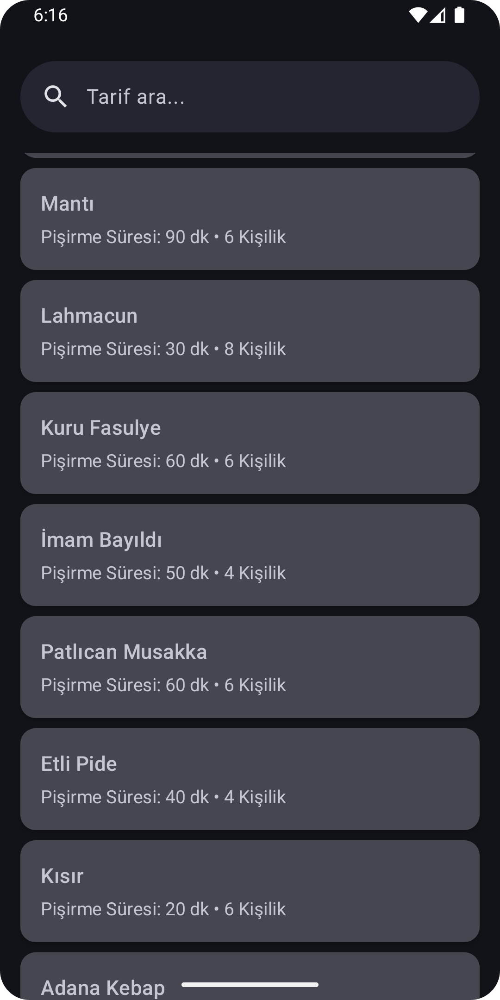

# KitchenCraft - Turkish Cuisine Recipe App

  
  
  

## About the App

KitchenCraft is an Android application that presents the rich flavors of Turkish cuisine with a modern interface. Users can easily access traditional Turkish food recipes, search, and view detailed preparation steps.

This project was developed using Cursor AI's code suggestions and assistance. It demonstrates the effectiveness of AI-assisted development process by utilizing modern Android development practices and the latest technologies.

## Technical Specifications

- **Architecture**: MVVM (Model-View-ViewModel)
- **UI Framework**: Jetpack Compose
- **Programming Language**: Kotlin
- **Minimum SDK**: 25
- **Target SDK**: 34
- **Development Tool**: Cursor AI

### Technologies Used

- **Jetpack Compose**: Modern UI development
- **Coil**: Image loading and caching
- **Gson**: JSON parsing
- **Navigation Compose**: In-app navigation
- **Material Design 3**: UI components
- **StateFlow**: Reactive data management

## Features

- Over 50 traditional Turkish food recipes
- Real-time search functionality
- Detailed recipe viewing
  - Ingredient list
  - Step-by-step preparation
  - Cooking time
  - Serving size
